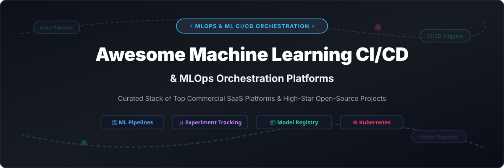

# ⚡ Awesome Machine Learning CI/CD & MLOps Orchestration Ecosystem 🚀

---

## 🌟 Top Machine Learning CI/CD & MLOps Orchestration Ecosystem

    

**Curated Stack of SaaS Platforms & High-Star Open-Source GitHub Projects**  
*Focused on ML Pipelines, Experiment Tracking, Model Serving, & Self-Hosted MLOps Orchestration*  

🗓️ **Last updated: October 2026**

---

## 📌 Executive Overview & Market Dynamics

### 📊 MLOps & ML CI/CD Market Size & Structure
> 📈 **Market Size**: The global MLOps & Machine Learning Orchestration market is estimated at **$2.3 Billion** and is projected to reach **$16.6 Billion by 2030** (CAGR ~32.4%).  
> ⚔️ **Market Dynamics**: The market is **highly fragmented** across niche tooling (experiment tracking, model serving, versioning), while cloud hyper-scalers (AWS, Databricks) attempt consolidation. Open-source frameworks (Kubeflow, MLflow, Ray) form the standard operational substrate.

---

## 🔍 Table of Contents
- [🏢 SaaS & Hosted Commercial Platforms](#-saas--hosted-commercial-platforms)
- [🔓 Open-Source GitHub Projects](#-open-source-github-projects)
  - [⚡ End-to-End MLOps Platforms](#-end-to-end-mlops-platforms)
  - [🔄 Workflow Orchestration](#-workflow-orchestration)
  - [📊 Experiment Tracking & Model Registry](#-experiment-tracking--model-registry)
  - [📦 Data & Model Versioning](#-data--model-versioning)
  - [🚀 Model Serving & Infrastructure](#-model-serving--infrastructure)
- [🤝 How to Contribute](#-how-to-contribute)
- [💖 Support](#-support)
- [⚠️ Disclaimer](#%EF%B8%8F-disclaimer)
- [⭐ Star History](#-star-history)

---

## 🏢 SaaS & Hosted Commercial Platforms

Below is a comparative breakdown of top commercial SaaS MLOps and CI/CD orchestration platforms, sorted by **Company Valuation / Scale (Descending)**.

| Platform / Product | Company Scale (Valuation / Revenue) | Starting Paid Tier Pricing | Free Tier / Trial Limit | Key Features & Best Use Case |
| :--- | :--- | :--- | :--- | :--- |
| 🟧 **[Amazon SageMaker Pipelines](https://aws.amazon.com/sagemaker/pipelines/)** | **~$1.8 Trillion** (AWS parent market cap) | **$0.05/hour** (ml.t3.medium instance) + usage | **Free Tier**: 250 hours/month of ml.t3.medium for first 2 months | Native AWS CI/CD pipeline triggers, Feature Store, and line tracking. *Best for AWS-native ML workloads.* |
| 🧱 **[Databricks (MLflow)](https://www.databricks.com/)** | **$43 Billion** (Valuation) | **$0.07 / DBU** (Pay-as-you-go Premium) | **14-day Free Trial** (Includes 14 days of free DBU compute) | Managed MLflow on Lakehouse architecture with Delta Lake & Spark. *Best for enterprise Spark & Delta Lake teams.* |
| 🪄 **[Weights & Biases (W&B Launch)](https://wandb.ai/)** | **$1.25 Billion** (Valuation) | **$50/user/month** (Team Tier) | **Free Forever**: 1 seat, 100 GB storage, unlimited tracking | Experiment tracking, W&B Launch on K8s/Vertex/SageMaker, LLM observability. *Best for experiment tracking & launch.* |
| ☄️ **[Comet ML](https://www.comet.com/)** | **~$150 Million** (Valuation) | **$179/month** (Startup Tier) | **Free Forever**: Single user, 1 concurrent job, 5 GB storage | Track experiments, model comparisons, and production monitoring. *Best for ML experiment management.* |
| ⚡ **[ClearML SaaS](https://clear.ml/)** | **~$100 Million** (Valuation) | **$15/user/month** (Pro Tier) | **Free Forever**: 3 team members, 100 GB storage | Open-core enterprise platform, agent orchestration, data management. *Best for open-core MLOps scaling.* |
| 🪶 **[Flyte Cloud / Union.ai](https://union.ai/)** | **~$60 Million** (Valuation) | **$0.10/credit** (~$250/mo minimum) | **14-day Free Trial** ($300 free compute credits) | Kubernetes-native workflow orchestration for production ML pipelines. *Best for K8s ML pipeline orchestration.* |
| 🌊 **[Neptune.ai](https://neptune.ai/)** | **~$30 Million** (Valuation) | **$150/month** (Team Plan) | **Free Forever**: Individual plan, 1 seat, 200h tracking/mo | Metadata store for experiment tracking and model registry at scale. *Best for scale experiment logging.* |
| 📊 **[Iterative Studio (DVC)](https://iterative.ai/)** | **~$25 Million** (Valuation) | **$50/user/month** (Team Plan) | **Free Forever**: Community tier, 1 user, 3 projects | Web UI for DVC data & model versioning and experiment tracking. *Best for Git-backed data versioning UI.* |
| 🎯 **[Valohai](https://valohai.com/)** | **~$15 Million** (Valuation) | **$99/user/month** (Growth Plan) | **14-day Free Trial** (Full platform feature access) | MLOps pipeline orchestration with strict version control and compliance. *Best for reproducible enterprise ML.* |

---

## 🔓 Open-Source GitHub Projects

### ⚡ End-to-End MLOps Platforms

| Project | GitHub Stars Badge | License | Description & Use Case |
| :--- | :--- | :--- | :--- |
| **[Apache Airflow](https://github.com/apache/airflow)** |  | Apache-2.0 | **De facto workflow orchestration standard**. Python DAGs for scheduling, monitoring, and executing pipelines. |
| **[Kubeflow](https://github.com/kubeflow/kubeflow)** |  | Apache-2.0 | **CNCF-graduated cloud-native AI standard**. Complete lifecycle: Pipelines, Katib tuning, Training Operator, and KServe. |
| **[Metaflow](https://github.com/Netflix/metaflow)** |  | Apache-2.0 | **Netflix human-centric ML framework**. Write Python; Metaflow handles versioning, cloud scaling, and execution. |
| **[ZenML](https://github.com/zenml-io/zenml)** |  | Apache-2.0 | **Extensible MLOps + LLMOps framework**. Stack-based, cloud-agnostic pipelines with 50+ infrastructure integrations. |
| **[MetaMaid](https://github.com/intuit/metamai)** |  | Apache-2.0 | **Intuit automated ML workflow platform**. Horizontal scaling and fault tolerance for large-scale data generation. |

---

### 🔄 Workflow Orchestration

| Project | GitHub Stars Badge | License | Description & Use Case |
| :--- | :--- | :--- | :--- |
| **[Prefect](https://github.com/PrefectHQ/prefect)** |  | Apache-2.0 | **Python-native workflow orchestration**. Dynamic DAG-less workflows with automatic retries and caching. |
| **[Argo Workflows](https://github.com/argoproj/argo-workflows)** |  | Apache-2.0 | **Kubernetes-native container engine**. Orchestrates parallel jobs using DAGs or step-based workflows. |
| **[Dagster](https://github.com/dagster-io/dagster)** |  | Apache-2.0 | **Data asset-centric orchestration**. Software-defined assets with deep observability and data quality testing. |
| **[Kestra](https://github.com/kestra-io/kestra)** |  | Apache-2.0 | **Declarative YAML-based orchestration**. 500+ plugins for building language-agnostic workflows. |
| **[Flyte](https://github.com/flyteorg/flyte)** |  | Apache-2.0 | **Lyft Kubernetes-native orchestrator**. Strongly typed inputs/outputs with built-in task caching and lineage. |

---

### 📊 Experiment Tracking & Model Registry

| Project | GitHub Stars Badge | License | Description & Use Case |
| :--- | :--- | :--- | :--- |
| **[MLflow](https://github.com/mlflow/mlflow)** |  | Apache-2.0 | **De facto experiment tracking standard**. Tracking, model registry, projects, and LLM evaluation metrics. |
| **[ClearML Open-Source](https://github.com/allegroai/clearml)** |  | Apache-2.0 | **Auto-magical experiment tracking & MLOps**. Zero code changes required for experiment logging and autoscaling. |
| **[mlsolid](https://pkg.go.dev/github.com/zeddo123/mlsolid)** |  | MIT | **Go + Redis + S3 high-performance experiment tracking**. Fast metadata indexer with automated model benchmarking. |

---

### 📦 Data & Model Versioning

| Project | GitHub Stars Badge | License | Description & Use Case |
| :--- | :--- | :--- | :--- |
| **[DVC (Data Version Control)](https://github.com/iterative/dvc)** |  | Apache-2.0 | **Git-compatible data & model versioning**. Tracks large datasets, model artifacts, and pipeline stages via Git. |
| **[lakeFS](https://github.com/treeverse/lakeFS)** |  | Apache-2.0 | **Git-like data lake operations**. Branch, commit, merge, and rollback operations on S3/GCS data lakes. |
| **[Pachyderm](https://github.com/pachyderm/pachyderm)** |  | Apache-2.0 | **Data-driven pipeline & versioning platform**. Containerized data processing with complete data lineage tracking. |

---

### 🚀 Model Serving & Infrastructure

| Project | GitHub Stars Badge | License | Description & Use Case |
| :--- | :--- | :--- | :--- |
| **[Ray](https://github.com/ray-project/ray)** |  | Apache-2.0 | **Unified compute framework for AI**. Scalable distributed training, hyperparameter tuning (Ray Tune), and serving (Ray Serve). |
| **[Apache Beam](https://github.com/apache/beam)** |  | Apache-2.0 | **Unified batch and stream data processing**. Portable pipeline execution on Flink, Spark, or Dataflow. |
| **[BentoML](https://github.com/bentoml/BentoML)** |  | Apache-2.0 | **Model serving & packaging framework**. High-performance API serving for ML models and LLMs. |
| **[Optuna](https://github.com/optuna/optuna)** |  | MIT | **Automatic hyperparameter optimization**. Light-weight, efficient search space pruning for ML frameworks. |
| **[Evidently](https://github.com/evidentlyai/evidently)** |  | Apache-2.0 | **ML model monitoring & drift detection**. Evaluate, test, and monitor ML models in production environments. |
| **[Feast](https://github.com/feast-dev/feast)** |  | Apache-2.0 | **Open-source feature store for machine learning**. Serve features consistently across training and real-time inference. |
| **[KServe](https://github.com/kserve/kserve)** |  | Apache-2.0 | **Kubernetes-native model serving platform**. Standardized inference protocol across PyTorch, XGBoost, and LLMs. |

---

## 💡 Custom MLOps Solution Architecture

When building a custom open-source MLOps platform, stack selections depend on infrastructure maturity:
- **Kubernetes-Native Core**: Combine **[Kubeflow](https://github.com/kubeflow/kubeflow)** or **[Flyte](https://github.com/flyteorg/flyte)** with **[KServe](https://github.com/kserve/kserve)** for cloud-native orchestration and inference.
- **Python-First Data Science**: Use **[Metaflow](https://github.com/Netflix/metaflow)** or **[ZenML](https://github.com/zenml-io/zenml)** for rapid iteration from notebook to production cloud compute.
- **Experiment & Lineage Tracking**: Deploy **[MLflow](https://github.com/mlflow/mlflow)** or **[ClearML](https://github.com/allegroai/clearml)** along with **[DVC](https://github.com/iterative/dvc)** for 100% reproducible data and model pipelines.

---

## 🤝 How to Contribute

1. Fork the repository.
2. Add or update entries in `README.md` following the tabular layout.
3. Ensure GitHub project links and star badges are included.
4. Open a Pull Request with a clear description of the changes.

---

## 💖 Support

Thank you for visiting and using this repository! If you find this curated collection of MLOps and Machine Learning CI/CD tools helpful, please consider starring ⭐, forking 🍴, or sharing it with your colleagues and community.

If you would like to support ongoing maintenance and content updates, you can buy me a coffee via the Sponsor Dashboard:  
👉 **[Sponsor & Support on GitHub](https://github.com/sponsors/ishandutta2007)** ☕

---

## ⚠️ Disclaimer

- This is a **community-curated** list — not exhaustive and not an official endorsement.
- ML CI/CD and MLOps platforms process production model weights and enterprise data; ensure proper network security policies and compliance hardening.
- All trademarks belong to their respective owners.

---

## ⭐ Star History

---

<b>Made with ❤️ for ML Engineers, Data Scientists, and MLOps Practitioners.</b>

